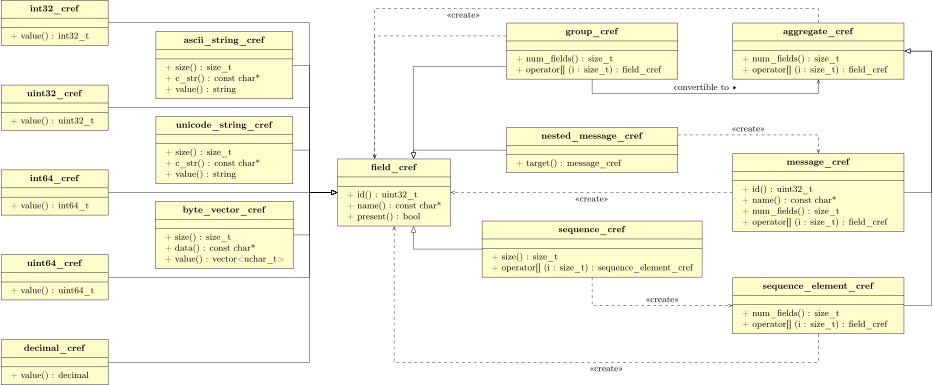

Introduction
--------------

In the financial domain, FAST (FIX Adapted for STreaming) is a data compression technology used to meet the challenge of transferring huge volumes of market data between financial institutions with low latency. It is a standard developed by FIX Protocol Ltd., specifically aimed at optimizing data representation on the network. Although it was initially designed for the financial industry, the application of it is not specific to market data. It can be applied to other domains which require data transfers with high throughput and low latency.

Previously, OCI has developed an open source native C++ implementation of the FAST Protocol, QuickFAST[www.quickfast.org]. In recent months, however, OCI has identified approaches to further optimize the processing of FAST messages and simplify its use. Some of the features of this new approach include avoiding in-memory data representation for application types that are not type safe; accessing the data structure which does not require the use of string comparison; an alternative to the use of reference counted pointers for small objects to improve space and speed efficiency. The result of this effort is a new open source product called mFAST which was developed from the ground up to provide an easy to use and yet more efficient FAST encoder/decoder. Like QuickFAST, mFAST is also implemented in C++. However, mFAST incorporates some advanced techniques such as region-based memory management and the flyweight and visitor design patterns. These make mFAST more user friendly and significantly more efficient than QuickFAST.

Compared to QuickFAST, mFAST offers the following features:

### An easier to use application type system
The FAST encoding is performed in accordance with a control structure called a template. A template controls the encoding of the stream by specifying the order and structure of fields, their field operators and the binary encoding representations to use. A FAST template is defined with a concrete syntax using XML format. One of the most distinctive advances of mFAST over QuickFast is its ability to generate C++ application types using the XML specification. If you are familiar with CORBA or DDS, this process is tantamount to the proxy/stub code generation using an IDL compiler.

### Lower external dependencies
In addition to the C++ standard library, the core mFAST library uses header-only BOOST libraries to provide platform portability. In addition, it uses TinyXML2 for XML parsing. TinyXML2 has only one source and one header file and it is statically linked to mFAST applications.
QuickFAST, on the other hand, requires several non-header only libraries (thread, system, file systems, etc) and Xerces.

### Smaller memory footprint
In our measurements, mFAST applications are about 30 to 50 percent of their QuickFAST counterparts, depending on whether the applications are decoder/encoder only or using both, and also on whether the applications use offline type generation.

### Better runtime efficiency
Based on our evaluation on a data stream of 30000 messages, mFAST decoder is nearly 8 times faster and the encoder is more than 12 times faster than QuickFAST.


Evaluation
--------------------
In this section, we evaluate the memory footprint and runtime performance of applications developed on top of mFAST and QuickFAST.  All of the evaluation is performed on a 2009 Macbook Pro with 2.26 GHZ Intel Core 2 Duo CPU. The OS used is Mac OS/X 10.8.4. Applications are compiled with Apple LLVM version 4.2 with libstdc++. Both mFAST and QuickFast use BOOST version 1.54.0. In addition, QuickFAST is dependent on Xeres (version 3.1 used) while mFAST has no such dependency.

### Memory Footprint Comparison
The core of mFAST is a unique and very compact application type system and all additional functionality, such as  the FAST decoder and encoder, are implemented as visitors and can be linked to applications independently. This makes the mFAST library very modular.  For example, if the FAST encoder is not needed for an application, it need not be linked into the application and it won't consume the memory footprint of the application executable. On the other hand, QuickFAST does not exhibit such fine grain modularity. The encoder and decoder are in the same module and inseparable without a significant effort to refactor the code.

To see how small an mFAST application is compared to that of QuickFAST. We implemented two test programs to decode a FAST data stream in a file using mFAST. One of them (named mf\_fixed\_decode) used  mFAST type generator to produces application types on a sample FAST XML file and then used the generated type to drive the decoder. The second test program (mf\_generic\_decode) directly parsed a FAST specification into memory and used the parsed information to drive the decoder without the code generation step.To understand the encoder affect the footprint, we also modify the above programs to re-encode the messages right after decoding. The modified programs are named  mf\_fixed\_decode\_encode and mf\_generic\_decode\_encode.

On the QuickFAST side, we used the PerformanceTest located in the QuickFAST example directory for comparison. Like mFAST mf_generic_\decode, the QuickFAST PerformanceTest program parsed a FAST specification on the fly and decoded an input data stream from a file. However, it did not assemble the decoded messages. Instead, it notified the application via a callback object. Whenever there's a new data field to be processed, the QuickFAST decoder invokes the callback object to provide the name of the data field and the decoded value.

QuickFAST also has a GenericMessageBuilder class which actually builds an entire message. In order to provide a functional equivalent program to our mFAST counterparts (because both mf\_fixed\_decode and mf\_generic\_decode actually build entire messages), we modified the original PerformanceTest to use the GenericMessageBuilder (coupled  with a NullMessageConsumer) and named the modified program as qf_generic_decode. Similarly, qf\_generic\_decode\_encode is the QuickFAST equivalent of mf\_generic\_decode\_encode.

On the other hand, the decoded results from QuickFAST PerformanceTest program cannot be fed back to QuickFAST encoder API  because it requires  assembled messages. Therefore, we don't have the re-encode equivalent of QuickFAST PerformanceTest.

To make fair comparison, both mFAST and QuickFAST libraries are statically linked into their respective applications. However, Xerces and some other BOOST run-time libraries which QuickFAST depended on were still dynamically linked into the executables. On the other hand,  the BOOST library used by mFAST is header only; there is neither link dependency on BOOST nor on Xerces for mFAST.

The following  are the sizes of executables compiled  using -O3 flag without debug information.

* mf\_fixed\_decode : 460,448 bytes
* mf\_fixed\_decode\_encode : 575,848 bytes
* mf\_generic\_decode : 610,948 bytes
* mf\_generic\_decode\_encode : 726,364 bytes
* QuickFAST PerformanceTest : 1,292,688 bytes
* qf_generic_decode : 1,417,000 bytes
* qf_generic_decode\_encode : 1,427,220 bytes

As you can see, the mFAST executables are about 30% to 40% of the QuickFAST versions; which is quite a reduction, not to mention that mFAST versions do not link to other dynamic libraries as their QuickFAST counterparts.

### Runtime Efficiency Comparison
To compare the runtime performance of mFAST and QuickFAST, we used the above test programs to decode a data stream file with 30000 messages. The following were the execution times for the programs.

* mf\_fixed\_decode  : 115 msec
* mf\_fixed\_decode\_encode : 251 msec
* mf\_generic\_decode : 117 msec
* mf\_generic\_decode\_encode : 262 msec
* QuickFAST PerformanceTest : 144 msec
* qf_generic_decode : 920 msec
* qf_generic_decode\_encode : 2710 msec


As we can see from the above numbers, mFAST performance was much improved over QuickFAST. For decoding FAST messages, mf\_generic\_decode was about 23% faster than QuickFAST PerformanceTest. Given that QuickFAST PerformanceTest did not actually assemble entire messages as mf\_generic\_decode did, that was not a fair comparison. When comparing mf\_generic\_decode with its QuickFAST functionally equivalence, namely qf_generic_decode, mFAST was 7.8 times faster than its QuickFAST counterpart.  To get the performance of FAST encoding, we used the execution times from the decode\_encode programs and subtracted from the data collected from the decode-only programs. The end result: mFAST was 12.3 times faster than QuickFAST.


Getting Started with mFAST
-------------------
### Prerequisite

mFAST is dependent on the following tools/libraries:

* BOOST 1.53 or higher [http://www.boost.org]
* CMake 2.8.8 or higher [http://cmake.org]
* tinyXML2 [http://www.grinninglizard.com/tinyxml2] (setup as a submodule in the git repository)

### Building the code
mFAST uses CMake as its build system. On Unix systems, you can simply following the instruction below to compile the code.

    $ cd mfast
    $ mkdir build
    $ cd build
    $ cmake ..
    $ make

This uses the CMake out-of-source building approach to compile the code. You can also use `make install` to install the built library and tool into the system predefined path (/usr/local). For convenience, we will refer the build directory as `$MFAST_BUILD_DIR`.

The build system can be configured via `-DOption=Value` syntax when invoking cmake. Here are a list of commonly used configuration options applicable to  mFAST.

* CMAKE\_BUILD\_TYPE : Specify the building mode such as debug or release. Valid values are
    - None (default)
    - Debug
    - Release
    - RelWithDebInfo
    - MinSizeRel
* BUILD\_SHARED\_LIBS : whether to build mFAST as shared/dynamic linked library. Valid values are ON and OFF with default OFF. If the value is ON,  both static and shared library would be built. Notice that for application to link against mFAST shared libraries, the preprocessor macro MAST\_DYN\_LINK must be defined for the application sources.
* BOOST\_ROOT : specify the root directory for your BOOST installation. If you have a problem with the build system finding your BOOST installation after specifying BOOST_ROOT, use `cmake --help-module FindBoost` in the command line to get further information.
* CMAKE\_INSTALL\_PREFIX : specify the installation prefix for mFAST libraries and code generation tool.

To make sure mFAST will work correctly on your platform, you can run the unit test program `$MFAST_BUILD_DIR/tests/mfast_test`.

On a Microsoft Windows system with MSVC, you can download the CMake GUI tool to generate MSVC project files. The building process and unit test program require the boost DLLs; therefore make sure the BOOST DLL path is in your PATH environment variable before compiling mFAST.


### Basics of FAST templates
Before we dive into the detail of the mFAST APIs, we need to briefly introduce the FAST template specification to facilitate our further discussion. Conceptually, a FAST template is similar to a `struct` in the C language. It contains one or more fields of primitive types, groups or sequences. For the FAST specification version 1.1, there are only 7 primitive types: int32, uInt32, int64, uInt64, decimal, string and byteVector. A string type can be further divided into ASCII and unicode string types. A group is similar to a nested struct in C. It comprises an ordered set of other fields. A sequence is a repeated group similar to vector of structure in C++. In addition, it is also possible to nest another template inside a template, in which case the field is called `templateRef`. A `templateRef` field can have a specified name or not. A templateRef with a name specified is called static templateRef whereas a templateRef without a name specified is called dynamic templateRef. A static templateRef is treated as if the content of the referenced template is directly copied into the referencing template under the FAST encoding rule. A  dynamic templateRef, on the other hand, can be assigned to any value of a template recognizable to the encoder/decoder at runtime. In a certain sense, it is a way of accommodating an 'ANY' type in FAST. It can, however, only used to embed other templates, not to embed other primitive types, groups or sequences.

Except for templateRef, all fields can be declared as mandatory or optional.  Primitive type fields, in addition, can be specified with an `instruction context` which describes how the value of a field  can be interpreted relative to its previous value of the same field. For example, a `constant` instruction means the value of the field can never change except for it can be absent when the field is optional. A field with a copy instruction means the decoder should interpret the value of the field as its previous value when value is not present in the encoded stream. Otherwise, the value of the field is the same with the value on the stream.


The following fragment of XML is an example of a template definition:

    <templates xmlns="http://www.fixprotocol.org/ns/template-definition"
               templateNs="http://www.fixprotocol.org/ns/templates/sample"
               ns="http://www.fixprotocol.org/ns/fix">
    <template name="MDRefreshSample" id='10001'>
        <string name="BeginString" id=”8”> <constant value="FIX4.4"/> </string>
        <string name="MessageType" id=”35”> <constant value="X"/> </string>
        <string name="ApplVerID" id="1128" presence="optional"> <copy/> </string>
        <string name="SenderCompID" id=”49”> <copy/> </string>
        <uInt32 name="MsgSeqNum" id=”34”> <increment/> </uInt32>
        <sequence name="MDEntries">
            <length name="NoMDEntries" id=”268”/>
            <uInt32 name="MDUpdateAction" id=”279”> <copy/> </uInt32>
            <string name="MDEntryType" id=”269”> <copy/> </string>
            <string name="Symbol" id=”55”> <copy/> </string>
            <string name="SecurityType" id=”167”> <copy/> </string>
            <decimal name="MDEntryPx" id=”270”> <delta/> </decimal>
            <decimal name="MDEntrySize" id=”271”> <delta/> </decimal>
            <uInt32 name="NumberOfOrders" id=”346”> <delta/> </uInt32>
            <string name="QuoteCondition" id=”276”> <copy/> </string>
            <string name="TradeCondition" id=”277”> <copy/> </string>
        </sequence>
    </template>
    </templates>

To minimize the memory usage for applications in non-financial domains, mFAST supports 4 additional primitive types not in the FAST specification. They are int32Vector, uInt32Vector, int64Vector and uInt64Vector. These integer vector types have similar APIs to byteVector; however, neither *operator* nor *initial value* are supported for integer vectors. In essence, a field specified as `<int32Vector name="myfield" id="1" />` would be encoded exactly as follows:

  <sequence name="myfield" id="1">
    <int32 name="element"/>
  </sequence>


### Generating C++ classes from FAST XML specification files

mFAST provides two approaches to incorporate FAST template specification into applications. The first (and preferred) approach is using the tool `fast_type_gen` to  generate C++ types for corresponding FAST templates. Using the generated C++ types makes it easier to read/write application code and provides stronger type safety. It also eliminates the need to parse the XML specification at runtime and thus reduce application memory footprint. The `fast_type_gen` tool is located under the `$MFAST_BUILD_DIR/bin` directory. At current stage, it only takes FAST XML files as its arguments and generating C++ files without any options like the following.

    $MFAST_BUILD_DIR/bin/fast_type_gen test1.xml test2.xml

For each XML specification file, `fast_type_gen` will generate three files (.h, .inl and .cpp) with the base name of those generated files and the same with their corresponding xml file. The C++ namespace of the generated C++ classes are also the same with the base filename. Currently, There is no other way to change the namespace unless you change the filename of the input XML file or directly modify the generated code.

If your input XML specification files have dependencies among them, all input files must be generated at once; i.e. you cannot do something like `fast_type_gen input1.xml` and then `fast_type_gen input2.xml` if input2.xml is dependent on input1.xml. An input FAST specification file A is only dependent on another file B if and only if B contains a static templateRef where the name of templateRef is only defined in A. In addition, `fast_type_gen` cannot handle circular dependency between its input files.

To encode/decode FAST messages correctly, each FAST template must have a unique template identifier. The specification does not define how to map template names to template identifiers. In our implementation, we choose to use the number specified by the `id` attribute in the  template definition, as the template identifier for encoder/decoder purposes. Furthermore, even though  FAST specification does not have any restriction on what the id attributes for fields can be,  `fast_type_gen` can  generate valid C++ code only when the value for id attributes are unsigned 32 bits integers.

There are some limitations in the current implementation of mFAST. For one, `fast_type_gen` is not robust enough to report syntactic or semantic errors from its input files. It's possible that the code generation process can succeed and yet the generated code won't compile or even executed correctly if errors exist in its input files. For example, if the names of templates or fields are not valid C++ identifiers, the generated code would not compile. This is an issue to be addressed in the future release of this product.

Another approach to use a template specification is to explicitly read the XML file in the application; however, this approach loses type safety and the XML parser would increase the application memory footprint. We will further discuss the API for this approach later.


FAST Template to mFAST C++ Type Mapping
--------------------------------------

In order to maximize the space efficiency of deserialized FAST messages while providing a user friendly API,  mFAST employs a very unique mapping of FAST templates to C++ types.  Unlike OMG IDL/C++ type mapping or Google Protocol Buffers, where each message type is represented by a C++ struct/class and the struct/class is responsible for  resource management as well as providing getter/setter functions for accessing field values; mFAST separates those roles into different C++ classes. For the previous mentioned example FAST template  `MDRefreshSample`, three C++ classes named `MDRefreshSample`, `MDRefreshSample_cref` and `MDRefreshSample_mref` are generated by `fast_type_gen`. Based on their functionalities,  we name them as *value holder*, *constant reference* and *mutable reference* classes respectively.

A value holder class manages the internal resources needed by fields of a message, it does not provide  getters/setters to read or write its contained fields. The member functions it provides only allows you to construct/copy the value or to create the reference objects. Suppose the previous mentioned FAST templates XML is saved as 'example.xml', the generated `MDRefreshSample` would be as follows.


```
// example.h, generated from fast\_type\_gen example.xml
namespace example {

class MDRefreshSample_cref
: public mfast::message_cref {
// ...
};

class MDRefreshSample_mref
: public MDRefreshSample_cref {
// ...
};

class MDRefreshSample
: private boost::array<mfast::value_storage, 6>
, public mfast::message_type
{
public:
  enum {
    the_id = 10001
  };
  MDRefreshSample(
    mfast::allocator* alloc=mfast::malloc_allocator::instance());

  MDRefreshSample(
    const MDRefreshSample_cref& other,
    mfast::allocator* alloc=mfast::malloc_allocator::instance());

  MDRefreshSample_cref ref() const;
  MDRefreshSample_cref cref() const;
  MDRefreshSample_mref ref();
  MDRefreshSample_mref mref();
private:
  MDRefreshSample(const MDRefreshSample&);
  MDRefreshSample& operator = (const MDRefreshSample&);
};

mfast::templates_description* description();

} // namespace example
```


Constant and mutable reference objects, on the other hand, are used for reading/writing field values, testing the presence of a field, and querying field meta data. Each type in FAST specification, whether primitive or not, has its own representative constant/mutable reference classes. The following figure is the UML representation for the basic constant reference classes.



At the center of figure is the `field_cref` class, which is the base for all those constant reference classes can be directly used to refer fields. It provides `present()` for testing the presence of the value and other functions to query meta data such as `name()`, `id()`, or `field_type()`.

The classes to the left of `field_cref` represent the references for the FAST primitive types. All references classes for numeric types provides a `value()`
member function. The references classes for string and vector types provides interfaces like the const member function of `std::string` and `std::vector<T>` respectively.

`group_cref` and `sequence_cref`, representing group and sequence types in FAST, provides access to the nested fields or elements respectively. The `sequenece_element_cref` class is used to represent the elements in a sequence. It does not inherit from `field_cref` because it does not correspond to a field in FAST sense. The class `nested_message_cref`, on the other hand, represents  templateRef in FAST. The class `message_cref`, corresponding to  *template* in FAST, is the base class for topmost level application types. The class `aggregate_cref` provides an abstraction to represent a collection of fields regardless whether the containing type is a group, a message or a element in a sequence.

In the `MDRefreshSample` example, to read the contained fields, we need to use `cref()` to obtain an`MDRefreshSample_cref` object. The generated `MDRefreshSample_cref` class has a set of `get_xxx()` member functions, where `xxx` is the field names, used for reading a field value. Likewise, a set of `set_xxx()` member functions is generated for writing field values in `MDRefreshSample_mref`. All getter/setter member functions return constant and mutable reference objects of their corresponding field types. This is very different from Google protocol buffer where simple value are returned from getters or passed as parameter to setters.

Here is an example for reading field values in mFAST.

```
using namespace mfast;
void print_sample(const example::MDRefreshSample_cref& ref)
{
  cout << ref.get_BeginString().name() << " : " << ref.get_BeginString().c_str() << "\n";
  if (ref.get_ApplVerID().present())
     cout << ref.get_ApplVerID().name() << " : " << ref.get_ApplVerID().c_str() << "\n";
  cout << ref.get_MsgSeqNum().name() << " : " << ref.get_MsgSeqNum().value() << "\n";

  for (auto entry : ref.get_MDEntries()) {
     cout << entry.get_MDUpdateAction().name() << " : " << entry.get_MDUpdateAction().c_str();
   // ...
  }
}

example::MDRefreshSample message;

// message value is assigned somewhere else

print_sample(message.cref());
```

All mutable reference classes are derived from the const reference counterpart. In other words, `int32_cref` is the base class of `int32_mref`, `seqence_cref` is the base class of `sequence_mref`, etc. However, `field_mref` is not the base class of more specific mutable  reference classes for fields such as `int32_mref` or `sequence_mref`; instead, those classes have an explicit type conversion constructor so that it's possible to  `static_cast` from a `field_mref` object to a more specific mutable reference object. The following code demonstrates how to assign fields values.

```
using namespace mfast;
example::MDRefreshSample message;
example::MDRefreshSample_mref ref = message.mref();
mref.set_ApplVerID().as("A");
assert(mref.get_ApplVerID().present());

mref.set_SenderCompID.as("B");
mref.set_MsgSeqNum().as(1);
auto entries = mref.set_MDEntries();
entries.resize(4);
entries[0].set_MDUpdateAction(1);
// ...

// using omit_xxx() to make optional field absent after assigning value
mref.omit_ApplVerID();
assert(!mref.get_ApplVerID().present());
assert(mref.get_ApplVerID().size() == 0);

// clear() can also make optional field absent
mref.set_ApplVerID("A");
assert(mref.get_ApplVerID().present());
mref.set_ApplVerID().clear();
assert(!mref.get_ApplVerID().present());
assert(mref.get_ApplVerID().size() == 0);


// However, clear() make the size to 0 for
// mandatory vectors, strings and sequences.

assert(mref.set_SenderCompID.present());
assert(mref.set_SenderCompID.size() == 1);

mref.set_SenderCompID.clear(); // becomes zero length string
assert(mref.set_SenderCompID.present());
assert(mref.set_SenderCompID.size() == 0);
```

Notice that mFAST reference objects are like C/C++ build-in pointers in that no logic is involved to track the lifetime of the field/value they refer to; i.e. no reference counting is employed. Once a top level value holder object is destroyed, all the references stem from that value holder object become dangling references. Therefore, it is very important that a reference object cannot be used when its value holder object is destroyed. However, it is possible to create a new value holder object from an existing constant reference object, i.e. object cloning, so that the new value holder has a different lifetime than the object from which it was cloned.

Reference objects are small and inexpensive to copy: a constant reference object contains only 2 pointers internally while a mutable reference object contains 3 pointers. Because no reference counting is involved, copying a reference object does not impede efficiency by damaging cache performance and creating pipeline bubbles.


### Decoding/Encoding FAST Messages

FAST encoding rules require both the encoder and decoder to agree on a set of templates which can be used for the encoded stream. In mFAST, we use a `templates_description` object to package all the meta information on the set of templates needed by FAST encoder/decoder. For each FAST template XML file, `fast_type_gen` would generated a `templates_description` a free function named `description()`, which returns a pointer to a templates_description object, nested inside its own namespace. Before we can use the encoder/decoder, we must initialize it an array of pointer to `templates_description` objects. Here is an example how to initialize the mFAST decoder.

```
const mfast::templates_description* descriptions[] = {
example::description()  // generated from fast_type_gen
};

mfast::fast_decoder decoder;

// In current implementation, decoder.include() can only be called
// exactly once per decoder/encoder
decoder.include(descriptions);
```

In certain case, it might not be possible to decide the set of templates to use at compile time. mFAST also provides an alternative approach to generate the `templates_description` object at runtime with a string of FAST XML templates.

```
const char* xml_content = "<templates xmlns=\"http://www.fixprotocol.org/ns/template-definition\" ... </templates>";
mfast::dynamic_templates_description description(xml_content);
const mfast::templates_description* descriptions[] = {
&description
};
mfast::fast_decoder decoder;
decoder.include(descriptions);
```

After the decoder is properly initialized, we can decode a buffer as follows:

```
const char* first = buf;
const char* last = buf + buf_len;

try {
  whille (first != last) {
    mfast::message_cref msg = decoder.decode(first, last);
    // Caveat 1: the variable *first* would be updated to the start of next unread position after decode().
    // Caveat 2: msg is only valid before next decoder.decode() is called or decoder object is destroyed.

    if (msg.id() == MarketData_cref::the_id)
    {
        MarketData_cref sample = static_cast<MarketData_cref>(msg);
        print_sample(sample);
    }
  }
}
catch (boost::exception& ex) {
  // error handling
}
```

Similarly, encoding an application type into a `vector<char>` is as follows:

```
mfast::fast_encoder encoder;
encoder.include(descriptions);
std::vector<char> buffer;
buffer.reserve(1024);

example::MDRefreshSample message;
// ...  write fields into message

encoder.encode(message.cref(), buffer);
```

### Memory Management
To maximize runtime efficiency, mFAST  has an `mfast::allocator` abstract class for customizing the memory allocation strategy. The constructors of `fast_encoder`, `fast_decoder` and all generated types derived from `mfast::message_type` take a pointer to  `mfast::allocator` as an optional parameter. If the parameter is not supplied, the system would use a global allocator implemented in  `malloc()`,  `realloc()` and `free()`. If the parameter is supplied, caution must be taken that the  allocator out-live the objects using the allocator.

Suppose you implemented an allocator class called `memory_pool_alloactor`, the following demonstrates the incorrect and correct usage of allocators in mFAST.

```
mfast::message_cref get_message1(const char* buf, size_t sz)
{
  memory_pool_alloactor alloc;
  mfast::fast_decoder decoder(&alloc);
  decoder.include(descriptions);
  return decoder.decode(buf, buf+sz); // WRONG, the returned message_cref out-lives the decoder and alloc objects which it stems from.
}

memory_pool_alloactor msg_alloc;
message_type msg(&msg_alloc);

void get_message2(const char* buf, size_t sz)
{
  memory_pool_alloactor alloc;
  mfast::fast_decoder decoder(&alloc);
  decoder.include(descriptions);
  mfast::message_cref ref=decoder.decode(buf, buf+sz);
  msg = mfast::message_type(ref, &msg_alloc); // OK, copy construct a temporary message_type object
                                              // and then move it to msg. mFAST uses boost::move to
                                              // simulate rvalue reference in C++03.
}
```

### mFAST Visitor
Although it is generally much easier to access application types  using the getters/setters functions, as we have introduced, this might not be best way in certain situation such as logging the received messages in a human readable format. Using the getters to write a message logger requires prior knowledge of the application types and the logger functions may differ based on the application types. This kind of code tends to be unmanageable as the number of application types grows.

mFAST provides a better way to cope with the above scenario using the visitor pattern. The visitor pattern allows the separation of an object structure and the operations which operate on it without modifying the structure itself. To be more specific, in the context mFAST, you write a visitor class which has a set of overloaded `visit()` member functions. Each `visit()` member function takes an argument of concrete mFAST field reference types such as `int32_cref`, `ascii_string_cref` and `sequence_cref`, etc. You then create an instance of the visitor class at runtime and invoke the `accept()` member function of `message_cref` or `message_mref` with the parameter of the visitor object. Next, the `visit()` member functions will be called in the sequence of the fields contained in the message object.

There are two categories of the visitor class in mFAST: *accessor* and *mutator*. An accessor visitor is used to read the fields in a message object; therefore, the `visit()` member functions in the accessor visitor class only take constant reference objects as their arguments. Conversely, a mutator visitor is used to modify the fields in a message object so the `visit()` member functions in the mutator visitor class only take mutable reference objects as their arguments.
The follow example shows how to print an arbitrary mFAST message object without the knowledge of the fields in the message.

```
using namespace mfast;

// a generic message accessor
struct message_printer
{
  std::ostream& os_;
  indenter indent_;

  enum {
    visit_absent = 0 // indicating absent fields should not be visited
  };

  message_printer(std::ostream& os)
  : os_(os)
  {
  }

  template <typename PrimitiveTypes>
  void visit(const PrimitiveTypes& ref) const
  { // for int_cref<T>, decimal_cref, string_cref<T>, byte_vector_cref
    // and int_vector_cref<T>
      std::cout << indent_ << ref.name() << ":" << ref << "\n";
  }

  template <typename CompositeTypeRef>
  void visit(const CompositeTypeRef& ref, int) const
  { // for group_cref, sequence_cref, nested_cref

    os_ << indent_ << ref.name() << ":\n";
    ++indent_;
    ref.accept_accessor(*this);
    --indent_;
  }

  void visit(const sequence_element_cref&  ref, int index) const
  {
    os_ << indent_ <<  "[" << index << "]:\n";
    ++indent_;
    ref.accept_accessor(*this);
    --indent_;
  }
};

std::ostream& operator << (std::ostream& os, const mfast::message_cref& ref)
{
  message_printer printer(os);
  ref.accept_accessor(printer);
  return os;
}
```

A few things must be noted for the above example.
  - A constant value `visit_absent` must be defined in a visitor class to indicate whether the absent fields should be visitor (0) or not (1).
  - If you are familiar with the visitor pattern, you might be puzzled why the visit class does not use inheritance and virtual functions. In fact, we do use inheritance and virtual functions internally. We just wrap it so that a user  can write generic `visitor()` functions to combine several `visit()` member functions into one.
  - The `visit()` function for primitive types always take exactly one argument and those for non-primitive types always take `int` as second argument. This `int` argument is used for differentiation purposes only except for that for sequence\_element\_cref. In this case, the second argument is the zero based index of the passed-in element in the parent sequence object.
  - In the `visit()` member functions for non-primitive type, the line `ref.accept_accessor(*this);` (or `ref.accept_mutator(*this);` for mutator visitor classes) should be called; otherwise, the fields nested inside the group, sequence or templateRef won't be processed.


Conclusion
------------------

In this article, we introduced the newly designed framework for serializing application data using FAST encoding rule. The approaches employed in the implementation of mFAST allowed a slimmer and far more efficient encoder and decoder. With the use of design patterns, it is also easier to develop applications with mFAST.

However, mFAST at the current stage is not a complete replacement for QuickFAST. First of all, mFAST APIs are entirely different from QuickFAST. This makes it difficult to migrate existing applications from QuickFAST to mFAST. Second, QuickFAST has built-in modules for session management while mFAST is purely for data serialization. Therefore, if session management is essential, QuickFAST does provide that capability.

We are very excited about the development of mFAST so far and believe it has  potential to emerge from purely streaming FAST protocol to a more general serialization purpose for different formats. With the built-in reflective type system and visitor pattern support in its core, it is relatively easy to develop new encoding/decoding formats (such as FIX, JSON, Google Protocol Buffer) non-intrusively. For example, we already have a JSON encoder with only 140 lines of source code.

Currently, mFAST supports FAST specification version 1.1 only. Version 1.2 support is still under development.
